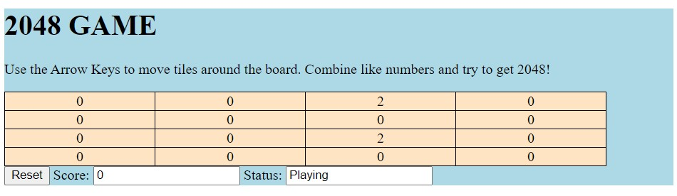

# 2048Game

## In this project, I re-created the game 2048 using an MVC structure with JavaScript and HTML.
#### The Model is encapsulated in a Game class with methods to move the tiles on the board, update the state of the game, and more. 
#### The View was created with some basic html.
#### The Controller is split between the client and server side, connecting the model to the view.
## Below is a screenshot of the game!

